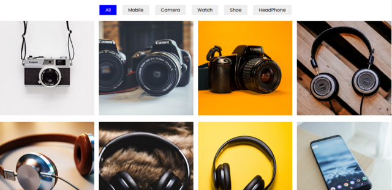

# Image Filter (Filtro de Imagem)

## Descrição:

Aplicativo web de filtro de imagem. 
Acesse o [LINK](https://junioralvesbr.github.io/filter-image/)

## Informações Técnicas:

Aplicativo criado com javaScript puro

### Tecnologias utilizadas:

  

### Imagens Utilizadas

## Autor: Junior Alves

